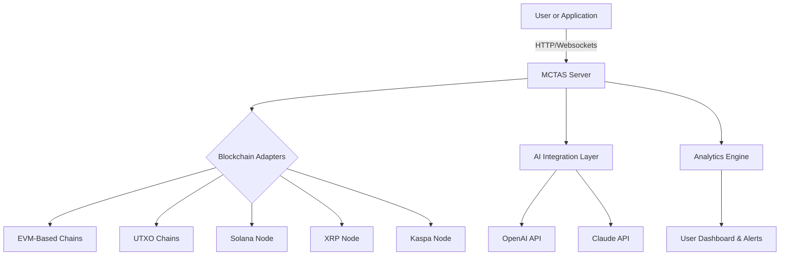

# Multi-Blockchain Transaction Analytics Suite: **MCTAS** 🚀

cryptoapis-mcp-transactions-analytics  
**DESCRIPTION:**  
**MCTAS** is a pioneering analytics platform powering comprehensive, real-time transaction tracking, categorization, and smart alerting across EVM, UTXO, Solana, XRP, and Kaspa blockchains. Leveraging advanced integrations—including support for OpenAI and Claude APIs—MCTAS goes beyond basic lookup and listing. Our responsive and multilingual platform provides AI-powered insights, predictive metrics, and interactive dashboards for wallet owners, crypto developers, compliance teams, and financial investigators.

---

## Download & Quickstart [⬇️]

To obtain your copy of **MCTAS**, click the link below:  

---

## Table of Contents 📚

- [Overview 🎯](#overview-🎯)
- [Mermaid System Diagram 🌐](#mermaid-system-diagram-🌐)
- [Crow’s Eye OS Compatibility Matrix 🖥️](#crows-eye-os-compatibility-matrix-🖥️)
- [Core Features ⭐](#core-features-⭐)
- [SEO-Optimized Capabilities 🔍](#seo-optimized-capabilities-🔍)
- [AI Integrations 🤖](#ai-integrations-🤖)
- [Profile Configuration Example ⚙️](#profile-configuration-example-⚙️)
- [Interactive Console Invocation 🖱️](#interactive-console-invocation-🖱️)
- [Language & Engagement 🌎](#language--engagement-🌎)
- [Customer Support 💬](#customer-support-💬)
- [Disclaimer ⚠️](#disclaimer-⚠️)
- [License 📄](#license-📄)
- [Download & Quickstart (Again) ⬇️](#download--quickstart-⬇️)

---

## Overview 🎯

**MCTAS**—Multi-Chain Transaction Analytics Suite—unites the fractured landscape of blockchain transaction data by offering AI-driven insights, rule-based monitoring, and cross-chain transaction lineage analyses. Building on the knowledge streams provided by CryptoAPIs, our tool is inspired by the need for enterprise-grade analytics coupled with intuitive responsiveness. Whether for a developer, researcher, regulatory body, or crypto enthusiast, MCTAS delivers value through clarity, speed, and actionable intelligence.

---

## Mermaid System Diagram 🌐

Visualize the ecosystem, from API orchestration to user dashboard.  
Feel the flow:

---

## Crow’s Eye OS Compatibility Matrix 🖥️

| OS                   | Status      | Notes                    |  
|----------------------|-------------|--------------------------|  
| 🟩 Linux (All distros)| Full Support| Optimized for Ubuntu 24+ |  
| 🟦 Windows 11/10      | Full Support| WSL2 recommended         |  
| 🟩 macOS (Intel/ARM)  | Full Support| Apple silicon native     |  
| 🟥 BSD                | Experimental| Community contributions  |  
| 🟨 Docker             | Supported   | Official image available |  

---

## Core Features ⭐

- **All-in-One Multi-Blockchain Transaction Audit**  
  Aggregate, categorize, and track transactions across EVM, UTXO, Solana, XRP, and Kaspa in a unified interface.

- **AI-Powered Pattern Recognition**  
  Detect suspicious flows, wallet clustering, or anomalous behaviors via integrated OpenAI and Claude APIs.

- **Responsive, Adaptive UI**  
  Sleek dashboards adjust seamlessly from mobile to wide-screen ultrawide battlestations.

- **Intelligent Alerts & Automation**  
  Define custom rules—get push/email notifications, or trigger serverless workflows.

- **Multilingual, Accessible Analytics**  
  Effortlessly toggle between English, Spanish, Mandarin, Russian, Japanese, Hindi, and more—breaking the crypto data language barrier.

- **Time-Travel Trace**  
  Explore historical blockchain states and visualize the journey of tokens.

- **Advanced Search and Filtering**  
  Sift through millions of transactions with full-text, field-based, and AI-enhanced search mechanisms.

- **Secure, Role-Based Access**  
  Fine-grained access controls for teams, organizations, and public explorers.

---

## SEO-Optimized Capabilities 🔍

**Crypto transaction analytics platform** | **multi-chain transaction monitoring** | **blockchain compliance tools** | **artificial intelligence for crypto analysis** | **open-source blockchain explorer toolkit**  
Experience uninterrupted, high-performance blockchain data analytics—all with integrated blockchain data feeds, customizable real-time alerts, and future-proofed support for emerging chains.

---

## AI Integrations 🤖

- **OpenAI GPT**: Extract natural language queries from users, summarize transaction histories ("Show me risky addresses in the last 24 hours"), and categorize flows using embeddings.
- **Claude API**: Offer extended analytics with conversational summaries, and auto-suggest alerts or chart overlays based on past patterns and user behavior.

Both APIs can be enabled or disabled in your configuration, maintaining privacy and budget.

---

## Profile Configuration Example ⚙️

Personalize MCTAS for your data world.  
Example—YAML profile, ready to go:

    # mctas-profile.yaml
    user:
      displayName: "Satoshi's Apprentice"
      preferredLanguage: "en"
    integrations:
      openai:
        enabled: true
        apiKey: "<your-openai-key>"
      claude:
        enabled: false
    blockchains:
      enabled:
        - ethereum
        - bitcoin
        - solana
    alerts:
      - type: "large_txn"
        threshold: 5.0
        asset: "BTC"
      - type: "unknown_origin"
        action: "email"

---

## Interactive Console Invocation 🖱️

Walk-through to start **MCTAS** from a terminal:

    $ mctas start --profile ./mctas-profile.yaml --dashboard --port 9000

Typical expressive invocation includes flags for API token, blockchain enable/disable switches, output format (JSON, CSV, HTML), and real-time event streaming.

Shortcuts? Try:

    $ mctas quick-analyze --wallet "0xABC..." --chain ethereum

---

## Language & Engagement 🌎

Spanning six continents, crypto conversations don’t pause for sunrise.  
**MCTAS** responds in your language—English, Español, 中文, Русский, 日本語, हिंदी—so everyone finds signal in the noise.  
Localization improvements and crowdsourced translations welcome!

---

## Customer Support 💬

MCTAS’s team is always on—yes, really, 24/7/365!  
Reach us via the embedded chat widget, expert-moderated forums, or the support email queue.  
Expect a thoughtful response, not just autopilot scripts.

---

## Disclaimer ⚠️

The **MCTAS** platform is an open-source analytics suite for educational and lawful operational purposes. Blockchain data, while powerful, may include inaccurate or misleading activity. Always cross-verify sensitive financial actions. MCTAS integrates third-party APIs—ensure API usage aligns with their respective terms and privacy policies. By using this project, you acknowledge responsibility for your actions and any data processed through connected chains.

---

## License 📄

This project is licensed under the MIT License. See the [LICENSE](LICENSE) file for details.

---

## Download & Quickstart (Again) ⬇️

Instant deployment? Download your tailored suite from the portal:  

---

Let MCTAS illuminate the cryptocurrency landscape for you in 2026 and beyond! 🚨🌐✨